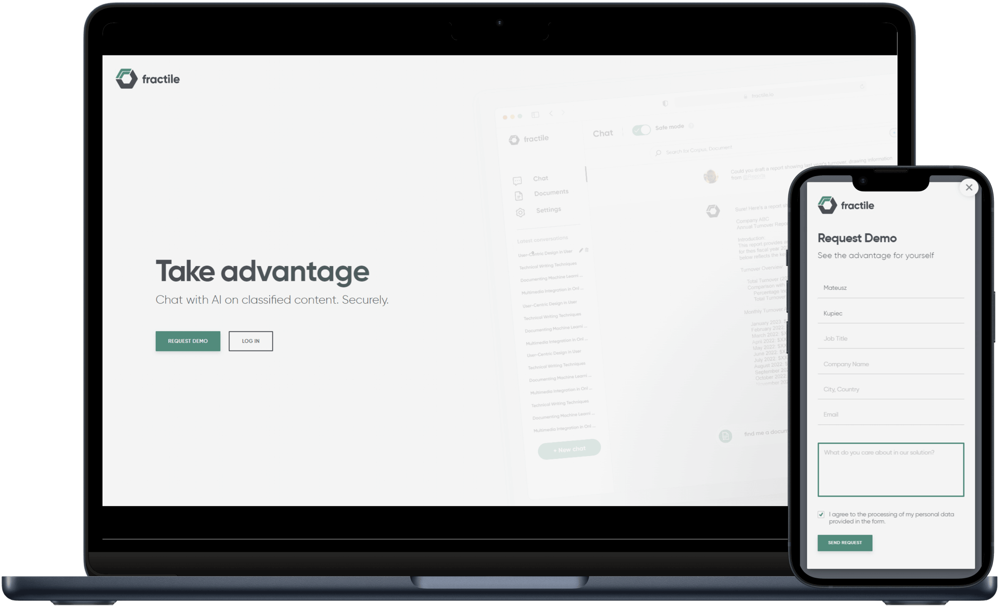

# My Latest Projects

| Screenshots | Details |
|:-|:--------|
|       | **2021 – Present**    Teurelis: A web app for managing interconnected reading notes    *JavaScript, Svelte, CSS, HTML*    [Documentation](https://github.com/m-kupiec/portfolio/blob/main/teurelis-app/README.md) |
|       | **12/2023**    Landing page for the startup&nbsp;I&nbsp;founded    *JavaScript, Svelte, CSS, HTML*    [teurelis.com](https://teurelis.com/) |
|       | **06/2023**    Landing page for a *Google for Startups Residency* participant    *JavaScript, CSS, HTML*    [fractile.io](https://fractile.io/) |
