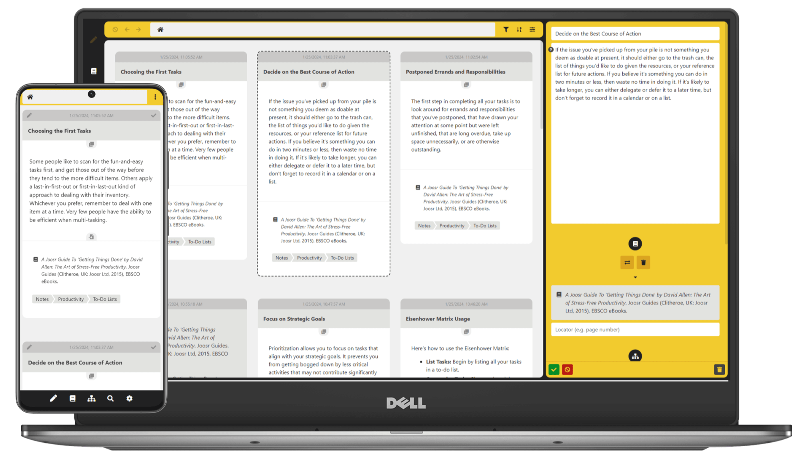
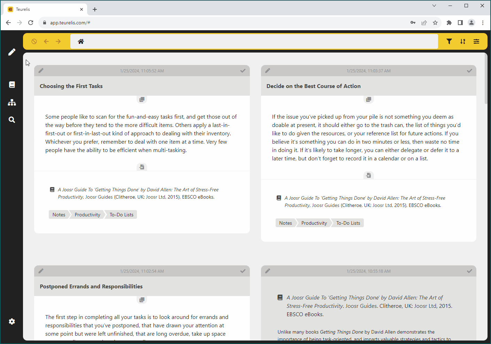
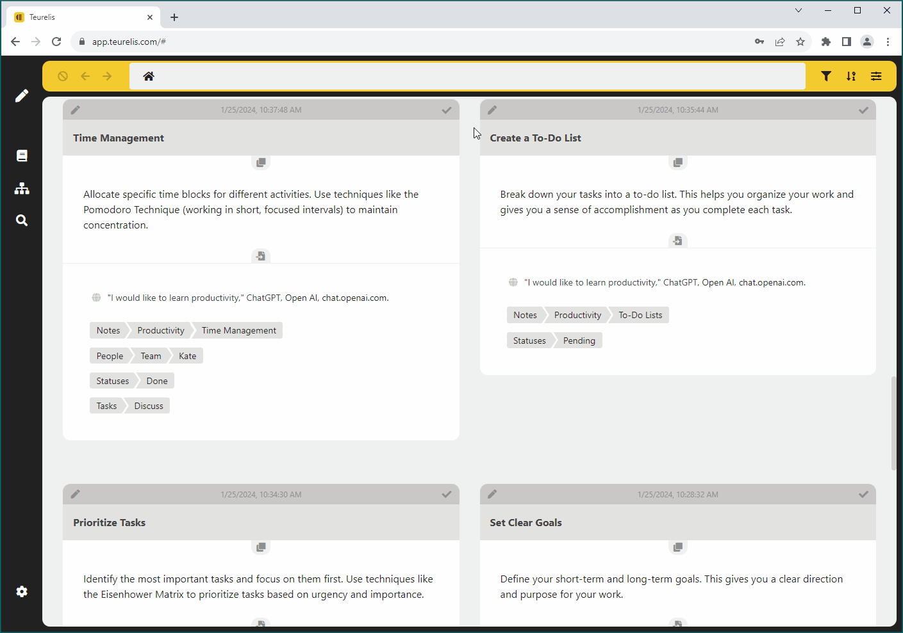
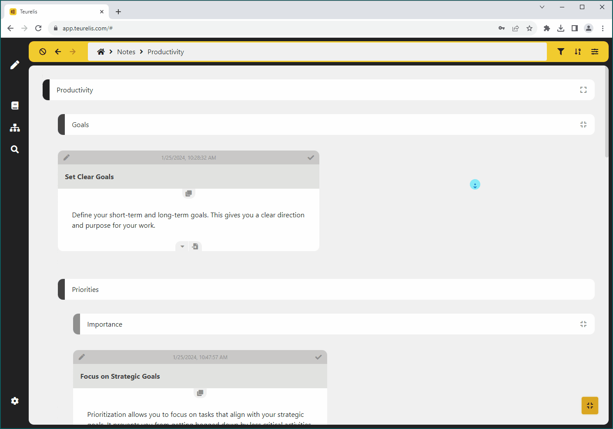
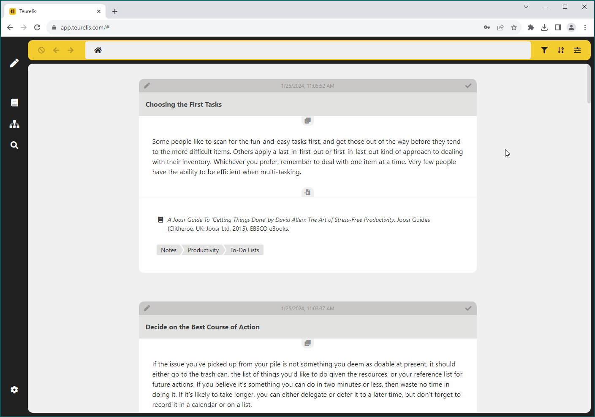
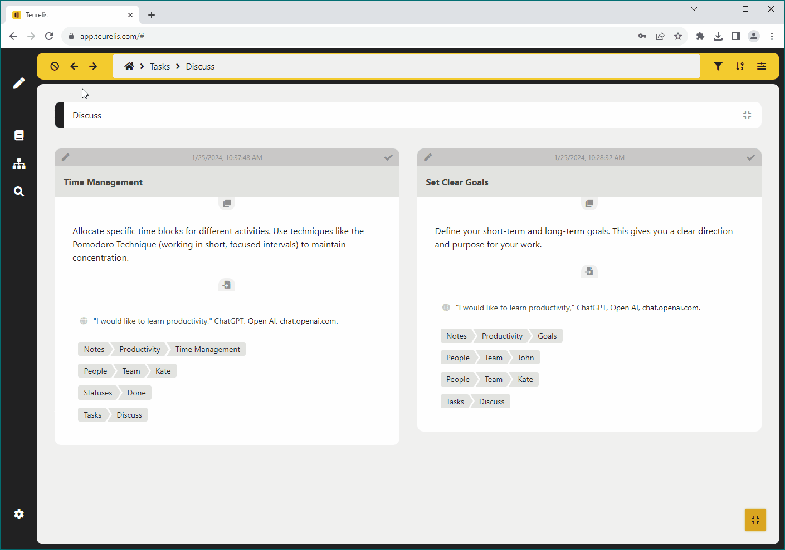
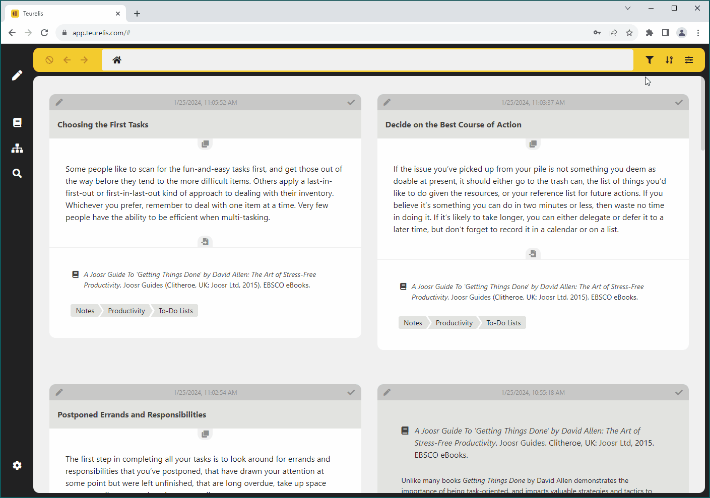
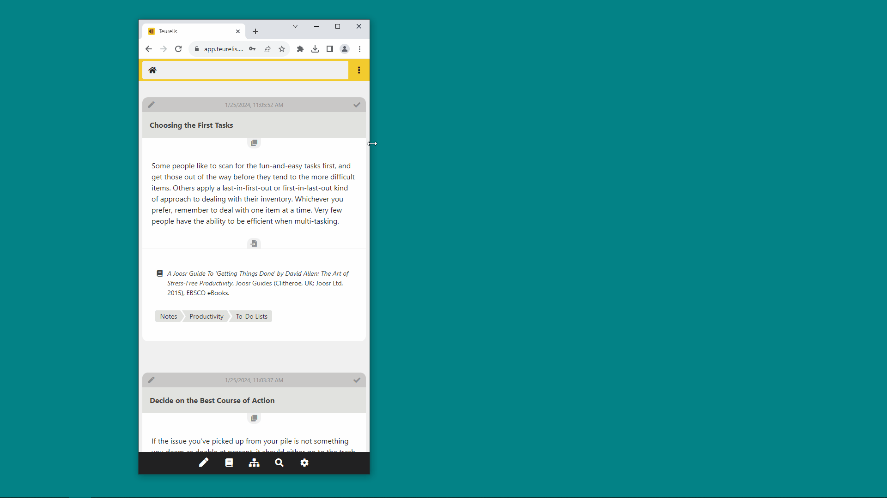

[](https://teurelis.com/)

## What is Teurelis?

Teurelis is a web app for managing interconnected reading notes. It is designed and built for learners, researchers, and thinkers, but can also be used to manage complex projects.

<br />
<a href="https://teurelis.com/">
  
</a>
<br />

### Development Status

The app has been developed since 2021. The current version is fully functional. All major features are implemented and more are in development.

## Features

### Bibliographic and Content Notes

The *bibliographic note* body consists of a bibliographic entry formatted according to [Chicago Manual of Style 17 (Notes and Bibliography)](https://www.chicagomanualofstyle.org/book/ed17/part3/ch14/toc.html).

Availbable bibliographic note types:
- Book
- Book Volume
- Book Part
- Book Volume Part
- Journal
- Article
- Online Resource
- Online Resource Part
- Miscellaneous Resource
- Miscellaneous Resource Part

The *content note* body consists of a title and body text with support for [Remarkable Markdown](https://github.com/jonschlinkert/remarkable) syntax.

Both *bibliographic note* and *content note* can contain the following types of metadata:
- related bibliographic resource
- subject paths
- multi-directional link groups to other notes

<br />
<figure>
  
  <figcaption>Click on the image to enlarge.</figcaption>
</figure>
<br />

### Bulk Editing

Available bulk edit actions:
- Adding/removing subject paths in the selected notes
- Connecting selected notes with a multidirectional link group

<br />
<figure>
  
  <figcaption>Click on the image to enlarge.</figcaption>
</figure>
<br />

### Different Layout Options

#### Choose between visually grouping notes in a subject tree or viewing them all in a single grid:

<br />
<figure>
  
  <figcaption>Click on the image to enlarge.</figcaption>
</figure>
<br />

#### Choose between a single-column or multi-column note desk layout:

<br />
<figure>
  
  <figcaption>Click on the image to enlarge.</figcaption>
</figure>
<br />

### Option Panels

Option panels provide quick access to:
- Exploring bibliographic references and subject path trees
- Detailed search options
- Account management (database export/import, password update, logout)

<br />
<figure>
  
  <figcaption>Click on the image to enlarge.</figcaption>
</figure>
<br />

### Browsing Options and Settings

#### Navigating forward and backward through the browsing history:

<br />
<figure>
  
  <figcaption>Click on the image to enlarge.</figcaption>
</figure>
<br />

#### Filtering notes based on detailed criteria, multiple sorting options, and desk/note display settings:

<br />
<figure>
  
  <figcaption>Click on the image to enlarge.</figcaption>
</figure>
<br />

### Responsive Design

All functionality is fully available on both mobile and desktop.

<br />
<figure>
  
  <figcaption>Click on the image to enlarge.</figcaption>
</figure>
<br />

### Browser Support

The latest versions of all major browsers are supported:


## Demo Access

For guest user login please go to [app.teurelis.com](https://app.teurelis.com/) and use the following credentials:

```
User/email: demo
Password: teurelis
```

The app landing page is available at [teurelis.com](https://teurelis.com/).

## Tech Stack

### Primary Technologies

- JavaScript
- [Svelte](https://svelte.dev/)
- [Userbase](https://userbase.com/) (user accounts, database)
- CSS
- HTML

### Deployment

- [Netlify](https://netlify.com/) (hosting, serverless functions)

### Tools

- [Visual Studio Code](https://code.visualstudio.com/)
- [Git](https://git-scm.com/)
- [npm](https://www.npmjs.com/)
- [webpack](https://webpack.js.org/)

### Regular dependencies

- [lz-string](https://github.com/pieroxy/lz-string) (string compression)
- [object-sizeof](https://github.com/miktam/sizeof) (estimating the size of JavaScript objects in memory)
- [remarkable](https://github.com/jonschlinkert/remarkable) (Markdown parsing)
- [dompurify](https://github.com/cure53/DOMPurify) (HTML sanitization)
- [@fortawesome/fontawesome-free](https://github.com/FortAwesome/Font-Awesome) (icon library)

### Development dependencies:

- [webpack-cli](https://github.com/webpack/webpack-cli) (running webpack with CLI commands)
- [webpack-dev-server](https://github.com/webpack/webpack-dev-server) (live build reload)
- [webpack-merge](https://github.com/survivejs/webpack-merge) (separate configurations for development and production environments without duplicating code)
- [html-webpack-plugin](https://github.com/jantimon/html-webpack-plugin) (automatic HTML generation)
- [css-loader](https://github.com/webpack-contrib/css-loader) (importing CSS into JavaScript)
- [svelte-loader](https://github.com/sveltejs/svelte-loader) (importing Svelte into JavaScript)
- [mini-css-extract-plugin](https://github.com/webpack-contrib/mini-css-extract-plugin) (extracting CSS into separate files)
- [svelte-preprocess](https://github.com/sveltejs/svelte-preprocess) (pre-processing of Svelte components--using PostCSS in this case)
- [autoprefixer](https://github.com/postcss/autoprefixer) (automatic CSS vendor prefixes)
- [css-minimizer-webpack-plugin](https://github.com/webpack-contrib/css-minimizer-webpack-plugin) (CSS minification)
- [terser-webpack-plugin](https://github.com/webpack-contrib/terser-webpack-plugin) (JavaScript minification)
- [svelte-i18n](https://github.com/kaisermann/svelte-i18n) (managing multiple languages in Svelte)
- [dotenv-webpack](https://github.com/mrsteele/dotenv-webpack) (managing environment variables)
